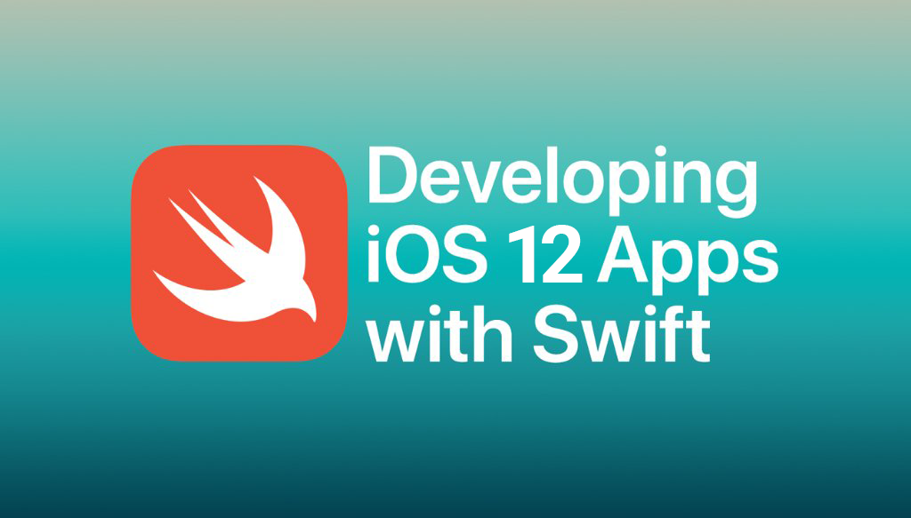

# Stanford Engineering CS193p: Developing iOS Apps

This is my path through the [iOS development course](https://www.youtube.com/playlist?list=PLPA-ayBrweUzGFmkT_W65z64MoGnKRZMq). There are 17 + 3 lectures and 6 + 3 assignments.

## Lectures
| Lecture | Slides | Video | Deadline | Progress
| ------------- | ------------- | ------------- | ------------- | -------------
| 1. | [Overview of iOS](slides/Lecture-1-Slides.pdf) |  | March 4, 2019 | :heavy_check_mark:
| 2. | [Model View Controller (MVC)](slides/Lecture-2-Slides.pdf) |  | March 6, 2019 | :heavy_check_mark:
| FL1 | Debugging: Xcode Tips & Tricks |  | March 8, 2019 | :heavy_check_mark: |
| 3. | [Swift](slides/Lecture-3-Slides.pdf) |  | March 11, 2019 | :heavy_check_mark: |
| 4. | [Protocols & Closures](slides/Lecture-4-Slides.pdf) |  | March 13, 2019 | :heavy_check_mark: |
| 5. | [Drawing in iOS](slides/Lecture-5-Slides.pdf) |  | March 15, 2019 | :heavy_check_mark: |
| 6. | [Multitouch & Multiple MVCs](slides/Lecture-6-Slides.pdf) |  | March 18, 2019 | :clock2: |
| 7. | [Multiple MVCs, Timer, Animation](slides/Lecture-7-Slides.pdf) |  | March 20, 2019 | :x: |
| 8. | [Animation](slides/Lecture-8-Slides.pdf) |  | March 22, 2019 | :x: |
| FL2 | Github, Source Code Workflow |  | March 25, 2019 | :x: |
| 9. | [View Controller Lifecycle, Scroll View](slides/Lecture-9-Slides.pdf) |  | March 27, 2019 | :x: |
| 10. | [Multithreading & AutoLayout](slides/Lecture-10-Slides.pdf) |  | March 29, 2019 |:x: |
| FL3 | Instruments |  | April 1, 2019 | :x: |
| 11. | [Drag and Drop, UITableView, & UICollectionView](slides/Lecture-11-Slides.pdf) |  | April 3, 2019 | :x: |
| 12. | [Emoji Art Demo, UITextField](slides/Lecture-12-Slides.pdf) |  | April 5, 2019 | :x: |
| 13. | [Emoji Art Demo, Persistence](slides/Lecture-13-Slides.pdf) |  | April 8, 2019 | :x: |
| 14. | [More about Documents, Demo](slides/Lecture-14-Slides.pdf) |  | April 10, 2019 | :x: |
| 15. | [Alert and Action Sheet, Notifications & KVO, Application Lifecycle](slides/Lecture-15-Slides.pdf) |  | April 12, 2019 | :x: |
| 16. | [Segues - Modal, Popover, Unwind, Embed](slides/Lecture-16-Slides.pdf) |  | April 15, 2019 | :x: |
| 17. | [Core Motion & Camera](slides/Lecture-17-Slides.pdf) |  | April 24, 2019 | :x: |

## Reading Assignments 

| Reading  | Name | Deadline | Progress
| ------------- | ------------- | ------------- | ------------- |
| 1. | [Reading 1: Intro to Swift](reading/Reading_1_Intro_to_Swift.pdf) | March 11, 2019 | :heavy_check_mark: |
| 2. | [Reading 2: More Swift](reading/Reading_2_More_Swift.pdf)  | March 15, 2019 | :heavy_check_mark: |
| 3. | [Reading 3: Finishing off Swift](reading/Reading_3_Finishing_Off_Swift.pdf)  | March 20, 2019 | :clock2: |	

## Problem Sets

| PS  | Name | Deadline | Progress
| ------------- | ------------- | ------------- | ------------- |
| 1. | [Assignment 1: Concentration](problemsets/Programming_Project_1_Concentration.pdf) | March 13, 2019 | :heavy_check_mark: |
| 2. | [Assignment 2: Set](problemsets/Programming_Project_2_Set.pdf) | March 18, 2019 | :clock2: |
| 3. | [Assignment 3: Graphical Set](problemsets/Programming_Project_3_Graphical_Set.pdf) | March 22, 2019 | :x: |
| 4. | [Assignment 4: Animated Set](problemsets/Programming_Project_4_Animated_Set.pdf) | April 3, 2019 | :x: |
| 5. | [Assignment 5: Image Gallery](problemsets/Programming_Project_5_Image_Gallery.pdf) | April 10, 2019 | :x: |
| 6. | [Assignment 6: Persistent Image Gallary](problemsets/Programming_Project_6_Persistent_Image_Gallery.pdf) | April 15, 2019 | :x: |
| 7. | *TBA* | *TBA* | :x:

## Deadlines debt

L 5,6,7,8
All reading 
PA2,3
